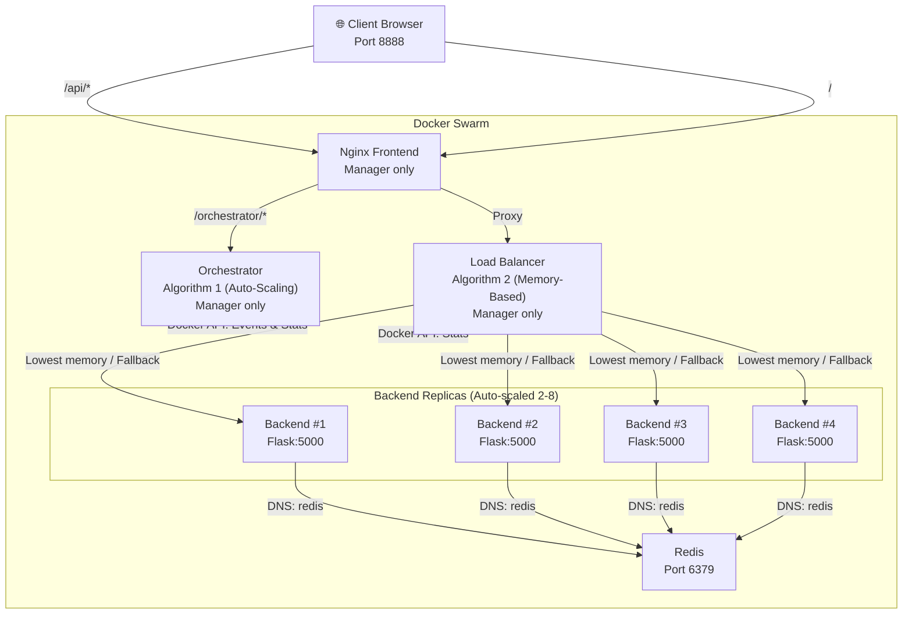

# Docker Swarm Load Balancing & Service Discovery
## Research Paper Implementation

> **Paper**: *"Load balancing and service discovery using Docker Swarm for microservice based big data applications"*  
> **Authors**: Neelam Singh, Yasir Hamid, Sapna Juneja, Gautam Srivastava, Gaurav Dhiman, Thippa Reddy Gadekallu, and Mohd Asif Shah

---

## 📖 Overview

This project implements the concepts described in the research paper using a practical microservice architecture deployed on **Docker Swarm**. It demonstrates four key capabilities:

1. **Active Service Orchestration (Algorithm 1)** — The orchestrator monitors memory/CPU consumption and dynamically auto-scales the backend replicas.
2. **Memory-Based Load Balancing (Algorithm 2)** — Requests are intelligently routed to the container with the lowest memory usage. If all containers exceed the 80% threshold, it gracefully falls back to round-robin distribution.
3. **Fault Tolerance (Self-Healing)** — Docker Swarm automatically replaces killed containers, maintaining high availability.
4. **Service Discovery** — Containers dynamically discover each other using Swarm's internal DNS overlay network.

## 🏗️ Architecture



## 📋 Prerequisites

- **Docker Desktop** (with WSL2 backend on Windows) or Docker Engine
- **Docker Compose**
- **Python 3.8+** (for the load generator script)
- At least **8 GB RAM** available

## 🚀 Quick Start

### Step 1: Initialize Docker Swarm
```bash
docker swarm init
```

### Step 2: Build the Docker Images
```bash
docker-compose build
```

### Step 3: Deploy the Stack to Swarm
```bash
docker stack deploy -c docker-compose.yml cc_research
```

### Step 4: Verify Deployment and Open Dashboard
```bash
# Check services are running
docker service ls

# Test the application
curl http://localhost:8888/api/
```
Open **`http://localhost:8888/`** in your browser to view the real-time monitoring dashboard, which tracks load balancing metrics, scaling events, and self-healing.

## 🧪 Testing & Validation

### Professional Load Testing (`load_generator.py`)
A powerful, asynchronous Python script is provided to test the cluster under various conditions.

1. **Install requirements**:
   ```bash
   pip install aiohttp
   ```
2. **Run tests**:
   - **Ramp Test** (gradually increasing load):
     ```bash
     python scripts/load_generator.py --mode ramp --concurrency 50 --duration 60
     ```
   - **Stress Test** (push to failure):
     ```bash
     python scripts/load_generator.py --mode stress --duration 120
     ```
   - **Burst Test** (send N requests rapidly):
     ```bash
     python scripts/load_generator.py --mode burst --requests 500
     ```
*All tests automatically save detailed Markdown reports (including latency percentiles and distribution charts) to the `results/` folder.*

### Chaos Test (Fault Tolerance)
```bash
bash scripts/chaos_test.sh
```
Kills a backend container and measures exactly how fast Swarm replaces it. Results are auto-saved to `results/chaos_test_results.md`.

### Service Discovery Test
```bash
bash scripts/service_discovery.sh
```
Proves that containers discover each other via DNS, not hardcoded IPs.

## 🌍 Multi-Node Simulation

Don't have multiple physical machines? You can simulate a 3-node cluster using Docker-in-Docker:

```bash
# Run the automated setup
bash scripts/simulate_multinode.sh full

# Check cluster status
bash scripts/simulate_multinode.sh status

# Tear down the simulation
bash scripts/simulate_multinode.sh down
```

## 🔧 Useful Commands

```bash
# View running services and replicas
docker service ls

# View logs for the Load Balancer (Algorithm 2)
docker service logs cc_research_loadbalancer

# View logs for the Orchestrator (Algorithm 1)
docker service logs cc_research_orchestrator

# Remove the entire stack
docker stack rm cc_research
```

## 📁 Project Structure

```
cc_research/
├── README.md                 # This file
├── docker-compose.yml        # Main Swarm stack definition
├── docker-compose.multinode.yml # Multi-node simulation config
├── backend/                  # Flask microservice (Algorithm targets)
├── frontend/                 # Nginx proxy and HTML Dashboard
├── loadbalancer/             # Algorithm 2 implementation (Memory routing & Fallback)
├── orchestrator/             # Algorithm 1 implementation (Active Auto-Scaling)
├── scripts/                  # Testing scripts (load_generator, chaos_test, etc.)
└── results/                  # Auto-generated markdown test results
```
